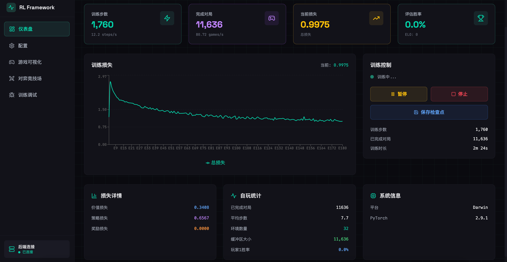
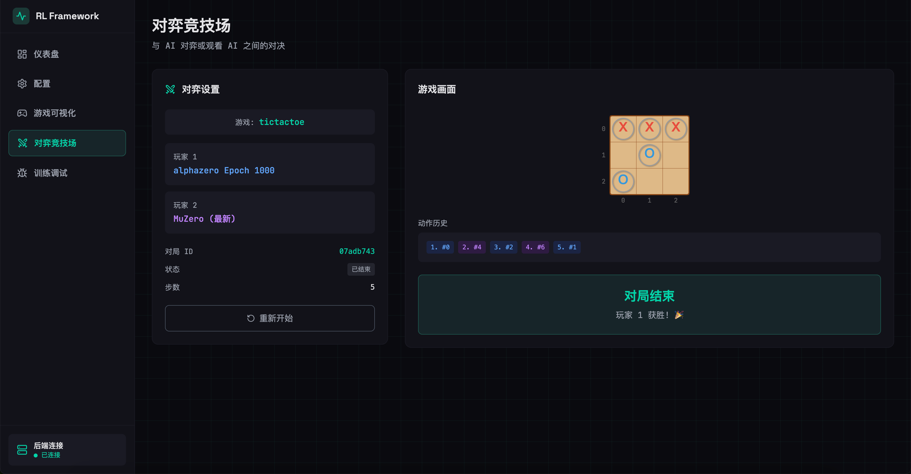
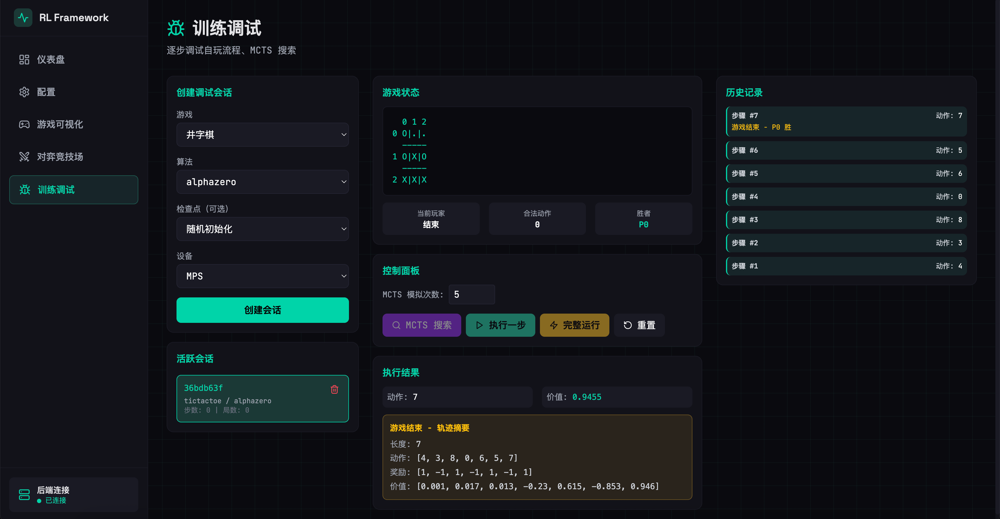
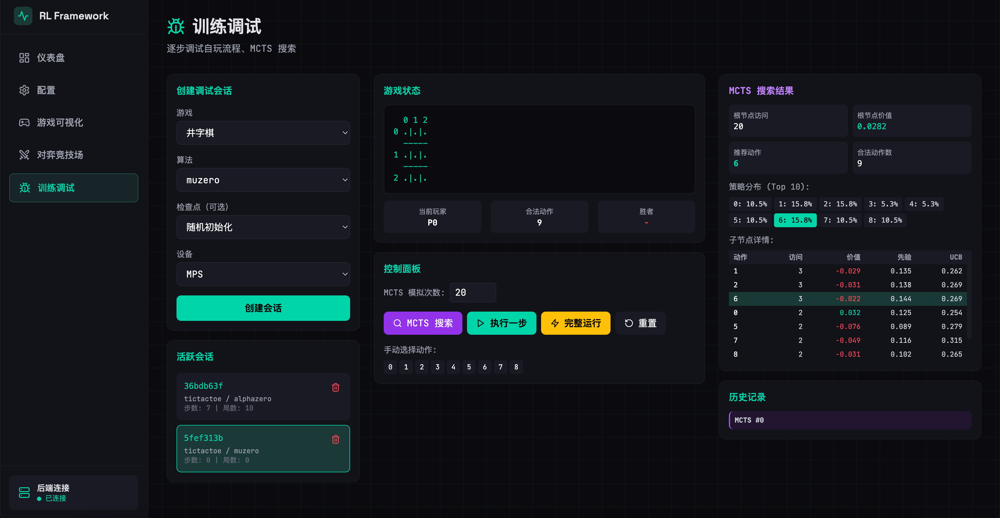
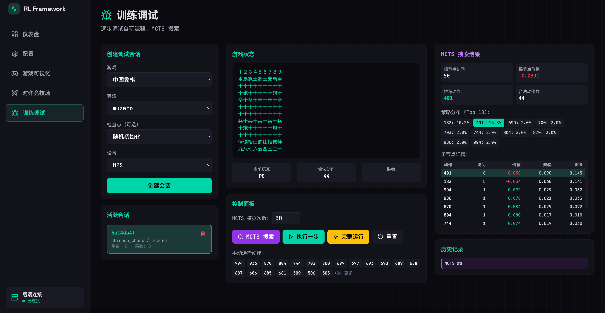

# ZeroForge

ZeroForge 是一个现代化的 AlphaZero/MuZero 训练框架，提供完整的自博弈强化学习流程，支持多线程异步自玩、DDP 多卡训练、Web 可视化界面和游戏对弈功能。

## 特性

- 🎮 **游戏插件化** - 通过 `Game` 接口快速接入新游戏，自动验证和注册
- 🕹️ **Gymnasium 支持** - 一键接入 Atari、经典控制、MuJoCo 等 25+ 环境
- 🧠 **算法模块化** - 支持 AlphaZero、MuZero、Gumbel 系列，可扩展
- 🔍 **完整 MCTS** - GPU 批推理 + CPU 本地树搜索
- 🚀 **高效并行** - 多线程异步自玩 + 叶节点批量推理
- 🖥️ **分布式训练** - 支持 DDP 多卡训练
- 🌐 **Web 界面** - React 前端 + FastAPI 后端，实时训练监控
- ⚙️ **智能配置** - 自动设备检测（CUDA > MPS > CPU），网络大小自适应
- 💾 **检查点管理** - 自动保存、加载模型，支持手动保存
- 🎯 **游戏对弈** - 人机对弈、AI vs AI、随机玩家

## 系统架构

```
┌─────────────────────────────────────────────────────────────────────────┐
│                          DistributedTrainer                             │
│                                                                         │
│  ┌───────────────────────────────────────────────────────────────────┐  │
│  │                    Phase 1: 自玩阶段（推理模式）                    │  │
│  │                                                                    │  │
│  │   concurrency 个游戏并发 → 完成一个启动下一个 → 直到 num_envs 完成  │  │
│  │  ┌─────────┐ ┌─────────┐ ┌─────────┐                              │  │
│  │  │ Game 1  │ │ Game 2  │ │ Game N  │  ← 最多 concurrency 个同时   │  │
│  │  │  MCTS   │ │  MCTS   │ │  MCTS   │                              │  │
│  │  └────┬────┘ └────┬────┘ └────┬────┘                              │  │
│  │       └───────────┴─────┬─────┘                                   │  │
│  │                         ↓ submit(obs, mask)                       │  │
│  │  ┌─────────────────────────────────────────────────────────────┐  │  │
│  │  │                  GPU 推理池 (LeafBatcher)                    │  │  │
│  │  │  - 收集叶节点请求，达到 batch_size 或 timeout 后批量推理     │  │  │
│  │  └─────────────────────────────────────────────────────────────┘  │  │
│  │                         ↓ 游戏结束产生轨迹                        │  │
│  │                   释放推理资源 (torch.cuda.empty_cache)           │  │
│  └───────────────────────────────────────────────────────────────────┘  │
│                                ↓                                        │
│  ┌───────────────────────────────────────────────────────────────────┐  │
│  │                    Phase 2: 训练阶段（训练模式）                    │  │
│  │  - 采样 80% 新数据 + 20% 经验池数据                                │  │
│  │  - 执行 train_batches_per_epoch 批次训练                          │  │
│  │  - 支持 DDP 多卡并行                                              │  │
│  └───────────────────────────────────────────────────────────────────┘  │
│                                ↓                                        │
│  ┌───────────────────────────────────────────────────────────────────┐  │
│  │                    Phase 3: 评估阶段（可选）                        │  │
│  │  - 新版本 vs 旧版本对弈 eval_games 局                              │  │
│  │  - 计算胜率和 ELO 评分                                            │  │
│  └───────────────────────────────────────────────────────────────────┘  │
│                                ↓                                        │
│                        保存检查点 → 进入下一 Epoch                       │
└─────────────────────────────────────────────────────────────────────────┘
```

### 核心组件

| 组件 | 文件 | 说明 |
|------|------|------|
| `DistributedTrainer` | `core/trainer.py` | 周期训练器，支持 DDP 多卡 |
| `LeafBatcher` | `core/mcts/batcher.py` | GPU 推理池，收集叶节点批量推理 |
| `LocalMCTSTree` | `core/mcts/tree.py` | 本地 MCTS 树实现 |
| `ReplayBuffer` | `core/replay_buffer.py` | 经验回放缓冲区 |

### 工作流程（周期模式）

```
每个 Epoch:
1. 自玩阶段: 运行 concurrency 个并发游戏，完成 num_envs 局
   - MCTS 叶节点 → batcher.submit() → 批量 GPU 推理
   - 游戏结束 → 收集轨迹作为"新数据"
   - 完成后释放推理资源

2. 训练阶段: 
   - 80% 新数据 + 20% 经验池采样
   - 执行 train_batches_per_epoch 批次训练
   - 新数据存入经验池

3. 评估阶段（Epoch 2+ 可选）:
   - 新模型 vs 旧模型对弈 eval_games 局
   - 计算胜率、更新 ELO 评分

4. 保存检查点 → 下一 Epoch
```

## 快速开始

### 安装（使用 uv）

```bash
# 安装 uv（如果未安装）
curl -LsSf https://astral.sh/uv/install.sh | sh

# 克隆仓库
git clone https://github.com/your-repo/ZeroForge.git
cd ZeroForge
uv venv --python cpython-3.14.2+freethreaded-linux-x86_64-gnu
# 同步依赖
uv sync
```

### 启动 Web 服务

```bash
# 启动后端 API 服务
uv run python -Xgil=0 main.py server

# 或指定端口
uv run uvicorn server.api:app --reload --port 8000
```

启动前端（另开终端）：

```bash
cd web
npm install
npm run dev
```

访问：
- 前端界面: http://localhost:3000
- API 文档: http://localhost:8000/docs

### 后端Ui功能截图






### 命令行训练

```bash
# 训练井字棋（简单游戏，快速验证，默认配置）
uv run python main.py train

# 训练井字棋（指定参数）
uv run python main.py train --game tictactoe --algorithm alphazero --epochs 100

# 训练中国象棋（复杂游戏，使用大网络）
uv run python main.py train --game chinese_chess --algorithm alphazero --network-size large --epochs 1000

# 多卡 DDP 训练
torchrun --nproc_per_node=4 main.py train --game chinese_chess --use-ddp
```

## 项目结构

```
ZeroForge/
├── core/                       # 核心框架
│   ├── game.py                 # 游戏抽象基类 (Game, GameState, GameMeta)
│   ├── algorithm.py            # 算法抽象基类 (Algorithm, Trajectory)
│   ├── config.py               # 配置类 (MCTSConfig, BatcherConfig)
│   ├── training_config.py      # 训练配置 (TrainingConfig)
│   ├── trainer.py              # 分布式训练器 (DistributedTrainer) ⭐
│   ├── selfplay.py             # 多线程自玩 (ThreadedSelfPlay, EnvWorker)
│   ├── mcts/                   # MCTS 实现
│   │   ├── node.py             # 树节点 (MCTSNode)
│   │   ├── tree.py             # 本地树 (LocalMCTSTree)
│   │   ├── search.py           # 搜索控制器 (MCTSSearch)
│   │   └── batcher.py          # GPU 批推理 (LeafBatcher) ⭐
│   ├── replay_buffer.py        # 经验回放缓冲区
│   ├── checkpoint.py           # 检查点管理
│   └── logging.py              # 结构化日志
│
├── games/                      # 游戏实现
│   ├── __init__.py             # 注册系统 + 验证
│   ├── tictactoe/              # 井字棋
│   ├── gomoku/                 # 五子棋 (9x9, 15x15)
│   ├── chinese_chess/          # 中国象棋
│   │   └── cchess/             # 象棋引擎
│   └── gymnasium/              # Gymnasium 适配器 ⭐
│       ├── wrapper.py          # 环境包装器
│       ├── presets.py          # 25+ 预设游戏
│       └── config.py           # Atari/MuJoCo 配置
│
├── algorithms/                 # 算法实现
│   ├── __init__.py             # 注册系统
│   ├── alphazero/              # AlphaZero
│   │   ├── algorithm.py        # 算法逻辑
│   │   └── network.py          # 神经网络
│   └── muzero/                 # MuZero
│       ├── algorithm.py        # 算法逻辑
│       └── network.py          # 神经网络
│
├── server/                     # Web 后端
│   ├── api.py                  # FastAPI 路由
│   └── manager.py              # 训练/游戏管理器
│
├── web/                        # React 前端
│   └── src/
│       ├── pages/              # 页面组件
│       └── components/         # 通用组件
│
└── main.py                     # CLI 入口
```

## 配置说明

训练配置 `TrainingConfig`：

```python
from core.training_config import TrainingConfig

config = TrainingConfig(
    # === 游戏和算法 ===
    game_type="chinese_chess",      # 游戏类型
    algorithm="alphazero",          # 算法 (alphazero/muzero)
    
    # === 网络 ===
    network_size="auto",            # auto/small/medium/large
    num_channels=128,               # 网络通道数（medium/large）
    num_blocks=6,                   # ResNet 块数（medium/large）
    
    # === 自玩配置 ===
    num_envs=256,                   # 每个 epoch 需要完成的游戏数量
    concurrency=16,                 # 同时并发运行的游戏数（实际并行线程数）
    train_batches_per_epoch=10,     # 每 epoch 训练批次数
    new_data_ratio=0.8,             # 新数据占比（80%新数据 + 20%经验池）
    
    # === 批处理 ===
    batch_size=256,                 # 训练批大小
    inference_batch_size=8,         # 叶节点推理批大小
    inference_timeout_ms=10.0,      # 推理超时（ms）
    
    # === 训练超参 ===
    num_epochs=1000,                # 训练轮数
    lr=1e-3,                        # 学习率
    weight_decay=1e-4,              # 权重衰减
    grad_clip=1.0,                  # 梯度裁剪
    
    # === MCTS ===
    num_simulations=50,             # 每步模拟次数
    c_puct=1.5,                     # UCB 探索常数
    dirichlet_alpha=0.3,            # Dirichlet 噪声
    dirichlet_epsilon=0.25,         # 噪声比例
    
    # === 回放缓冲区 ===
    replay_buffer_size=100000,      # 缓冲区容量
    min_buffer_size=200,            # 开始训练前最小样本数
    
    # === 评估（新旧版本对弈）===
    eval_games=5,                   # 每个 epoch 评估对弈局数
    eval_temperature=0.5,           # 评估时的动作采样温度
    
    # === 分布式训练 ===
    use_ddp=False,                  # 是否启用 DDP
    ddp_backend="nccl",             # DDP 后端 (nccl/gloo)
    
    # === 系统 ===
    device="auto",                  # auto/cuda/mps/cpu
)
```

### 关键参数说明

| 参数 | 说明 | 推荐值 |
|------|------|--------|
| `num_envs` | 每个 epoch 完成的游戏数量 | 128-512 |
| `concurrency` | 同时并发运行的游戏数 | CPU 核心数 |
| `inference_batch_size` | GPU 推理池批大小（**≤ concurrency**） | **concurrency / 2** |
| `inference_timeout_ms` | 推理超时（ms） | 5-10ms |
| `train_batches_per_epoch` | 每 epoch 训练批次数 | 10-50 |
| `new_data_ratio` | 新数据占比 | 0.8（80%新 + 20%旧） |
| `num_simulations` | MCTS 模拟次数 | 50-200 |
| `eval_games` | 每 epoch 评估对弈局数 | 5-20 |

> ⚠️ **注意**: 
> - `inference_batch_size` 不能超过 `concurrency`
> - **推荐设置为 `concurrency / 2`**：形成流水线，GPU 始终忙碌
> - 评估从 Epoch 2 开始（需要旧版本对比）

### 网络大小自动选择

- `small`: 井字棋等小游戏（MLP，~1K 参数）
- `medium`: 中等规模游戏（ConvNeXt 3层）
- `large`: 中国象棋等复杂游戏（ConvNeXt 6层，~100K+ 参数）

## DDP 多卡训练

```bash
# 单机 4 卡
torchrun --nproc_per_node=4 main.py train \
    --game chinese_chess \
    --algorithm alphazero \
    --use-ddp \
    --epochs 1000

# 或使用 Python API
from core.trainer import DistributedTrainer
from core.training_config import TrainingConfig

config = TrainingConfig(
    game_type="chinese_chess",
    use_ddp=True,
    ddp_backend="nccl",
)

trainer = DistributedTrainer(config)
trainer.setup()
trainer.run()
```

### DDP 架构

```
┌────────────────────────────────────────────────────────────────────┐
│                        Rank 0 (主进程)                             │
│  ┌──────────────────────────────────────────────────────────────┐ │
│  │                    自玩 + 推理                                │ │
│  │  LeafBatcher ← EnvWorker × N                                 │ │
│  │       ↓                                                       │ │
│  │  ReplayBuffer                                                 │ │
│  └──────────────────────────────────────────────────────────────┘ │
│                              ↓                                     │
│  ┌──────────────────────────────────────────────────────────────┐ │
│  │                    训练 (DDP)                                 │ │
│  │  Network (device:0) ←→ AllReduce ←→ Network (device:1-3)    │ │
│  └──────────────────────────────────────────────────────────────┘ │
└────────────────────────────────────────────────────────────────────┘
                              ↓ 梯度同步
┌────────────────────────────────────────────────────────────────────┐
│  Rank 1-3: 只参与训练梯度同步，不执行自玩                           │
└────────────────────────────────────────────────────────────────────┘
```

## 添加新游戏

1. 创建游戏目录 `games/mygame/`
2. 实现 `Game` 接口：

```python
from core.game import Game, GameState, GameMeta, ObservationSpace, ActionSpace
from games import register_game

@register_game("mygame")
class MyGame(Game):
    """我的游戏实现"""
    
    # === 必须实现的类方法 ===
    
    @classmethod
    def get_meta(cls) -> GameMeta:
        """返回游戏元数据"""
        return GameMeta(
            name="我的游戏",
            description="游戏描述",
            tags=["board", "strategy"],
            min_players=2,
            max_players=2,
        )
    
    # === 必须实现的属性 ===
    
    @property
    def observation_space(self) -> ObservationSpace:
        return ObservationSpace(shape=(C, H, W))
    
    @property
    def action_space(self) -> ActionSpace:
        return ActionSpace(n=100)
    
    @property
    def num_players(self) -> int:
        return 2
    
    @property
    def supported_render_modes(self) -> list:
        return ["text", "json"]  # 至少支持 text
    
    # === 必须实现的方法 ===
    
    def reset(self) -> np.ndarray:
        """重置游戏，返回初始观测"""
        ...
    
    def step(self, action: int) -> tuple:
        """执行动作，返回 (obs, reward, done, info)"""
        ...
    
    def legal_actions(self) -> list:
        """返回合法动作列表"""
        ...
    
    def clone(self) -> "MyGame":
        """克隆游戏状态（用于 MCTS）"""
        ...
    
    def render(self, mode: str = "text") -> Any:
        """渲染游戏状态"""
        if mode not in self.supported_render_modes:
            raise ValueError(f"不支持: {mode}")
        if mode == "text":
            return {"type": "text", "text": "..."}
        elif mode == "json":
            return {"type": "grid", "cells": [...]}
```

## Web API

| 端点 | 方法 | 描述 |
|------|------|------|
| `/api/training/start` | POST | 启动训练 |
| `/api/training/stop` | POST | 停止训练 |
| `/api/training/status` | GET | 获取训练状态 |
| `/api/training/save` | POST | 手动保存检查点 |
| `/api/games` | GET | 列出所有游戏 |
| `/api/games/{id}/start` | POST | 开始对弈 |
| `/api/games/{id}/action` | POST | 执行动作 |
| `/api/checkpoints` | GET | 列出检查点 |
| `/api/config/schema` | GET | 获取配置 schema |
| `/ws/training` | WebSocket | 实时训练状态 |

## 技术栈

- **深度学习**: PyTorch 2.9.1 + DDP
- **并行**: Python threading + GPU 批推理
- **Web 后端**: FastAPI + WebSocket
- **Web 前端**: React + Vite + Zustand
- **配置管理**: dataclasses

## Gymnasium 游戏支持

ZeroForge 支持所有 Gymnasium 兼容环境，包括 Atari、经典控制、MuJoCo 等 **25+ 预设游戏**。

### 安装依赖

```bash
# 基础 Gymnasium（经典控制游戏）
uv pip install gymnasium

# Atari 游戏（Breakout, Pong 等）
uv pip install "gymnasium[atari]" ale-py

# MuJoCo 物理仿真（Ant, HalfCheetah 等）
uv pip install "gymnasium[mujoco]"
```

### 使用方式

```python
from games import make_game, list_games

# 查看所有可用游戏（包含 25+ Gymnasium 预设）
print(list_games())

# 创建游戏
game = make_game("gym_cartpole")      # 经典控制
game = make_game("atari_breakout")    # Atari 游戏
game = make_game("mujoco_ant")        # MuJoCo 物理

# 标准游戏循环
obs = game.reset()
while not game.is_terminal():
    action = game.legal_actions()[0]
    obs, reward, done, info = game.step(action)
```

### 支持的游戏

| 类型 | 游戏 | 说明 |
|------|------|------|
| **Atari** | `atari_breakout`, `atari_pong`, `atari_spaceinvaders`... | 10 款经典街机 |
| **经典控制** | `gym_cartpole`, `gym_lunarlander`, `gym_mountaincar`... | 5 款简单环境 |
| **MuJoCo** | `mujoco_ant`, `mujoco_halfcheetah`, `mujoco_humanoid`... | 6 款物理仿真 |

### 算法选择

**Gumbel 系列算法**会自动检测环境是否支持 clone，选择最佳搜索实现：

```python
game = make_game("atari_breakout")

# 检查环境兼容性
print(game.supports_mcts)           # 是否支持传统 MCTS
print(game.recommended_algorithm)   # 推荐的算法

# 使用 Gumbel 算法（自动选择搜索实现）
algo = make_algorithm("gumbel_alphazero")
```

| 算法 | 搜索实现 | 说明 |
|------|---------|------|
| AlphaZero | MCTS | 需要 clone，棋类游戏推荐 |
| MuZero | MCTS | 需要 clone，使用 dynamics network |
| **Gumbel AlphaZero** | 自动选择 | 支持 clone → Gumbel+MCTS，否则简化版 |
| **Gumbel MuZero** | 自动选择 | 支持 clone → Gumbel+MCTS，否则 dynamics |

> **注意**: 大多数 Gymnasium 环境（包括 Atari）都支持 clone，Gumbel 算法会自动使用官方的 Gumbel+MCTS 实现。

## 路线图

- [x] 核心框架（Game, Algorithm, MCTS）
- [x] AlphaZero 实现
- [x] MuZero 实现
- [x] 井字棋游戏
- [x] 五子棋游戏 (9x9, 15x15)
- [x] 中国象棋游戏
- [x] **Gymnasium 支持**（Atari、经典控制、MuJoCo）
- [x] Web 训练界面
- [x] 游戏对弈功能
- [x] 检查点管理
- [x] 网络大小自适应
- [x] 多线程异步自玩
- [x] 叶节点批量推理
- [x] DDP 分布式训练
- [x] **Gumbel MuZero/AlphaZero 算法**
- [ ] 更多游戏（围棋、国际象棋）
- [ ] 混合精度训练 (AMP)
- [ ] 模型量化推理

## License

MIT License
